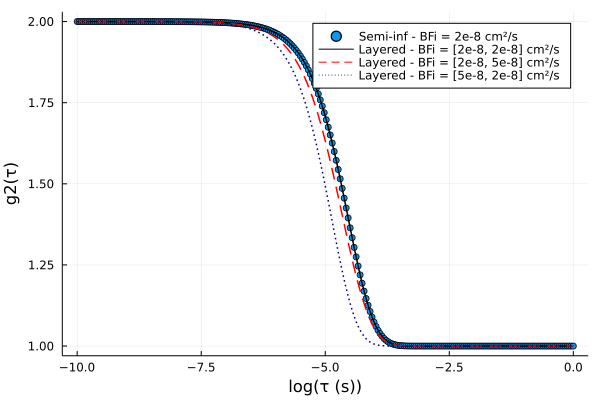

# Solutions of the Correlation Diffusion Equation

The following describes how to simulate the autocorrelation function g2 from solutions to the correlation diffusion equation in semi-infinite and layered media.
These simulations create a dynamic absorption term from solutions to the diffusion equation to compute the autocorrelation function.

## Semi-infinite

To compute the autocorrelation function g2 in a semi-infinite geometry we can use `g2_DA_semiinf_CW`
```@docs
g2_DA_semiinf_CW
```

This function has four required arguments that must be in order `τ, ρ, μa, μsp` and six keyword arguments `BFi, β, n_ext, n_med, z, λ` that can (or not) be defined using a key value.

```julia
julia> using LightPropagation
# first define your τ vector on a log scale
julia> τ = 10 .^(range(-10,stop=0,length=10))
julia> g2_DA_semiinf_CW(τ, 1.0,0.1, 10.0) # can simulate with default parameters
10-element Vector{Float64}:
 1.9999963846836883
 1.9999533076858178
 1.999397160946602
 1.9922498068573495
 1.9055550839639768
 1.3239163665819036
 1.000224562135667
 1.0
 1.0
 1.0
```

Naturally you will want to simulate for more `τ` values by defining `τ = 10 .^(range(-10,stop=0,length=10))`.
The previous simulation uses the default parameters. We can use keys to define aditional parameters...
```julia
julia> τ = 10 .^(range(-10,stop=0,length=10))
julia> g2_DA_semiinf_CW(τ, 1.0,0.1, 10.0, BFi = 1.6e-8, λ = 720.2) # can simulate with default parameters
10-element Vector{Float64}:
 1.9999972677126077
 1.9999647118888721
 1.9995443595433469
 1.994135632401783
 1.9275332521385895
 1.4160741400966292
 1.0009939892943926
 1.0000000000000007
 1.0
 1.0
```

It sometimes is helpful to use a structure to pass all the arguments. This can be done by defining a structure using `DAsemiinf_DCS`

```@docs
g2_DA_semiinf_CW
```

Now we can define a structure and use that to quickly simulate g2...

```julia
julia> τ = 10 .^(range(-10,stop=0,length=10))
julia> data = DAsemiinf_DCS()
julia> g2_DA_semiinf_CW(τ, data)

# you can change the arguments of the structure with keys
julia> data = DAsemiinf_DCS(μsp = 12.1, BFi = 1.2e-8, n_med = 1.2)
julia> g2_DA_semiinf_CW(τ, data)
```

## N-layered cylinder

Layered media follow a similar structure to the semi-infinite case with some more arguments. To compute the autocorrelation function g2 in a N-layered cylinder we can use `g2_DA_Nlay_cylinder_CW`
```@docs
g2_DA_Nlay_cylinder_CW
```

This function has four required arguments that must be in order `τ, ρ, μa, μsp` and nine keyword arguments `BFi, β, n_ext, n_med, z, λ, a, l, bessels` that can (or not) be defined using a key value.

```julia
julia> τ = 10 .^(range(-10,stop=0,length=10))
julia> g2_DA_Nlay_cylinder_CW(τ, 1.0, [0.1, 0.1], [10.0, 10.0], BFi = [2.1e-8, 3.0e-8]) # only define BFi
julia> g2_DA_Nlay_cylinder_CW(τ, 1.0, [0.1, 0.1], [10.0, 10.0], BFi = [2.1e-8, 3.0e-8], l = [0.8, 3.0]) # define BFi with layer thickness
```

Notice how some of the inputs are now a vector containing the properties of each layer. Here we have a 2 layer media therefore all the vectors have a length 2. If you are using more than 2 layers make sure each vector has the same length and you are explicitly defining all the key values. Generally, you don't need to define `bessels` as 1000 roots is usually sufficient. You can increase or decrease the number of roots by defining the key `bessels = besselroots[1:2000]` if you need.

Similarly, we can use a structure to define the inputs by using `Nlayer_cylinder_DCS`.
```@docs
Nlayer_cylinder_DCS
```

Now we can define a structure and use that to quickly simulate g2.... (will explictly define every input)
```julia
julia> τ = 10 .^(range(-10,stop=0,length=250))
julia> ρ = 1.0 # source-detector separation (cm)
julia> μa = [0.1, 0.1] # absorption coefficient of each layer (1/cm)
julia> μsp = [10.0, 10.0] # reduced scattering coefficient of each layer (1/cm)
julia> n_med = [1.0, 1.0] # index of refraction for each layer
julia> n_ext = 1.0 # index of refraction of external medium (air or detector)
julia> BFi = [2.0e-8, 2.0e-8] # Blood flow index ~αDb (cm²/s)
julia> l = [1.0, 10.0] # thickness of each layer (cm)
julia> a = 25.0 # radius of cylinder (cm)
julia> λ = 700.0 # wavelength of light (cm)
julia> z = 0.0 # depth within medium (cm) (z = 0,0 on top reflecting boudnary)
julia> data = Nlayer_cylinder_DCS(ρ = ρ, μa = μa, μsp = μsp, n_med = n_med, n_ext = n_ext, β = β, λ = λ, BFi = BFi, z = z, a = a, l = l, bessels = besselroots[1:2000])

# we can now define our correlation times τ
julia> g2_DA_Nlay_cylinder_CW(τ, data) 
```


### Comparing 2-layer to semi-infinite solution

```julia
julia> ρ = 1.0
julia> μa = 0.1
julia> μsp = 10.0
julia> τ = 10 .^(range(-10,stop=0,length=250))

julia> si = g2_DA_semiinf_CW(τ, ρ, μa, μsp, BFi = 2e-8)

julia> layered = g2_DA_Nlay_cylinder_CW(τ, ρ, [0.1, 0.1], [10.0, 10.0], BFi = [2.0e-8, 2.0e-8], l = [0.5, 10.0])
julia> layered2 = g2_DA_Nlay_cylinder_CW(τ, ρ, [0.1, 0.1], [10.0, 10.0], BFi = [2.0e-8, 5.0e-8], l = [0.5, 10.0])
julia> layered3 = g2_DA_Nlay_cylinder_CW(τ, ρ, [0.1, 0.1], [10.0, 10.0], BFi = [5.0e-8, 2.0e-8], l = [0.5, 10.0])

julia> scatter(log10.(τ), si, label = "Semi-inf - BFi = 2e-8 cm²/s", ylabel = "g2(τ)", xlabel = "log(τ (s))")
julia> plot!(log10.(τ), layered, label = "Layered - BFi = [2e-8, 2e-8] cm²/s", lw = 1.5, linecolor =:black)
julia> plot!(log10.(τ), layered2, label = "Layered - BFi = [2e-8, 5e-8] cm²/s", linestyle=:dash, lw = 1.5, linecolor =:red)
julia> plot!(log10.(τ), layered3, label = "Layered - BFi = [5e-8, 2e-8] cm²/s", linestyle=:dot, lw = 1.5, linecolor =:blue4)
```



At this point, change the optical properties and parameters to see how the solutions differ.
