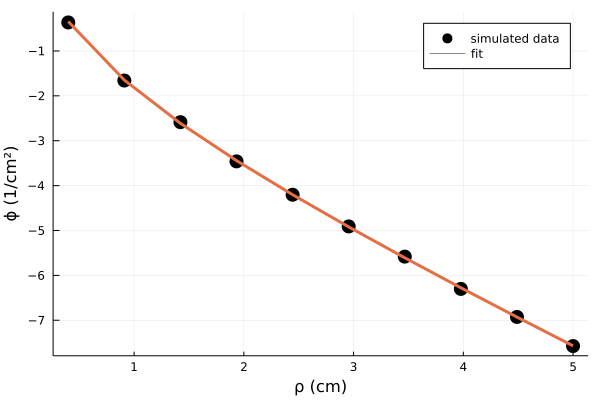
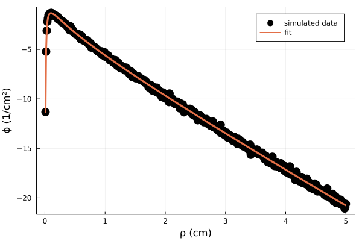

# Inverse Fitting

When dealing with experimental data, we often want to use our forward models in the inverse problem to recover quantitative data from measurements.

Here, we will walk through some basic examples to recover optical properties from both steady-state and time-domain measurements.

## Steady-State

The first thing we want to do is simulate some experimental data. Let's do that by defining our `ρ` values and true optical properties....

```julia
julia> using LightPropagation
julia> ρ_arr = range(0.4, stop = 5.0, length = 10) # define our SDS we want to simulate values for
julia> μa_true = 0.2; μsp_true = 10.0 # define true optical properties
julia> ydata = fluence_DA_semiinf_CW.(ρ_arr, μa_true, μsp_true)
```

One unfortunate thing is experiments usually have some noise... Let's use Noise.jl to add some multiplicative white noise with `stdev=0.05` and `mean=1.0`...
```julia
julia> using Noise
julia> y_noise = mult_gauss(ydata, 0.05, 1.0)
```

Now we are ready to fit. Let's use a standard nonlinear least squares Levenberg-Marquardt algorithm with LsqFit.jl

```julia
# need to set the bounds in the inverse problem 
ub = [1.0, 50.0] # upper bound for [μa, μsp]
lb = [0.01, 3.0] # lower bound for [μa, μsp]
p0 = [0.12, 18.2] # some initial guess for our algorithm

# set up our model we want to fit with
model(ρ, β) = log10.(fluence_DA_semiinf_CW.(ρ, β[1], β[2]))
```

The previous code block sets up the inverse problem for `LsqFit.jl`. It would be best to [read the docs](https://github.com/JuliaNLSolvers/LsqFit.jl) of `LsqFit.jl` first. One thing we need to be careful of is properly setting up our model to fit the data. `LsqFit` needs to know for what `xdata` it is trying to fit at and for what parameters `β` it is trying to optimize for. In our case `β` is an array containing the optical properties `β = [μa, μsp]` we are seeking. It is also advantageous to fit on a log scale to better normalize the residuals at very high and low fluence values.

We are now ready to fit...
```julia
julia> using LsqFit
julia> fit = curve_fit(model, ρ_arr, log10.(y_noise), p0, lower=lb, upper=ub)

## Let's quickly plot our results
julia> using Plots
julia> scatter(ρ_arr, log10.(y_noise), xlabel = "ρ (cm)", ylabel = "ϕ (1/cm²)", c=:black, label = "simulated data", ms=8) # with noise
julia> plot!(ρ_arr, model(ρ_arr, fit.param), lw = 3, label = "fit")
julia> #plot!(ρ_arr, model(ρ_arr, [μa_true, μsp_true]), label = "true") plots the true curve
```



Note that this will take several seconds to run in the beginning due to compile times but will be faster after the first plot. We can call our fit results...
```julia
julia> fit.param
2-element Vector{Float64}:
 0.2007638299707845
 9.95573558637554
```

Sometimes we also want to randomize our initial guess. We could instead define `p0` like...
```julia
julia> using Distributions
julia> p0 = [rand(Uniform(lb[1], ub[1])), rand(Uniform(lb[2], ub[2]))]
```

## Time-Domain

A similar approach in the time-domain can occur except our `xdata` is now `t` instead of `ρ`

```julia
julia> t_arr = range(0.01, stop = 5.0, length = 500) # define our SDS we want to simulate values for
julia> μa_true = 0.26; μsp_true = 13.0; ρ = 1.0  # define true optical properties and a single SDS
julia> ydata = fluence_DA_semiinf_TD(t_arr, ρ, μa_true, μsp_true)
```

Now, the noise in the time-domain for each bin typically follows a poisson distribution...
```julia
julia> using Noise
julia> y_noise = poisson(log10.(ydata), 500)

# need to set the bounds in the inverse problem 
julia> ub = [1.0, 50.0] # upper bound for [μa, μsp]
julia> lb = [0.01, 3.0] # lower bound for [μa, μsp]
julia> p0 = [0.12, 18.2] # some initial guess for our algorithm

# set up our model we want to fit with
julia> model(t, β) = log10.(fluence_DA_semiinf_TD(t, ρ, β[1], β[2]))
```

We are now ready to fit...
```julia
julia> using LsqFit
julia> fit = curve_fit(model, t_arr, y_noise, p0, lower=lb, upper=ub)

## Let's quickly plot our results
julia> using Plots
julia> scatter(t_arr, y_noise, xlabel = "ρ (cm)", ylabel = "ϕ (1/cm²)", c=:black, label = "simulated data", ms=8) # with noise
julia> plot!(t_arr, model(t_arr, fit.param), lw = 3, label = "fit")
```


```julia
julia> fit.param
2-element Vector{Float64}:
  0.2600394078015929
 12.913002920897537
```

## Fitting in layered media

The principles described previously apply similarly to layered media where we are just increasing the number of parameters we are fitting with.
Let's take for example a 2-layer media which yields potential variables of `μa1, μa2, μsp1, μsp2, l1, l2`. Now, this problem is already significantly more complex than the semi-infinite case when we were fitting for just one parameter. First, let's limit the scope to just fitting the optical properties and assume that the layer thickness are known. We can set up the problem like so...

```julia
julia> t_arr = range(0.05, stop = 2.0, length = 1000)
julia> ub = [1.0, 1.0, 50.0, 50.0] # upper bound for [μa1, μa2, μsp1, μsp2]
julia> lb = [0.01, 0.01, 3.0, 3.0] # upper bound for [μa1, μa2, μsp1, μsp2]
julia> p0 = [0.02, 0.02, 11.0, 11.0] # initial guess for [μa1, μa2, μsp1, μsp2]
```

We can now set up our `ydata` like the following...

```julia
julia> ρ = 1.0; n_med = [1.0, 1.0]; n_ext = 1.0; a = 5.0; z = 0.0
julia> μa = [0.01, 0.12]
julia> μsp = [8.2, 12.8]
julia> l = [1.0, 4.0]
julia> ydata = log10.(abs.(fluence_DA_Nlay_cylinder_TD(t, ρ, μa, μsp, n_ext, n_med, l, a, z, besselroots[1:600])))
```

One thing we need to be careful about is the fluence returning a negative value so we take the absolute value here. We can also use structures to pass arguments to the function. The next step is to set up our model but here `β` must contain an array of all our parameters...

```julia
julia> model(t, β) = log10.(abs.(fluence_DA_Nlay_cylinder_TD(t, ρ, [β[1], β[2]], [β[3], β[4]], n_ext, n_med, l, a, z, besselroots[1:600])))
## we can then fit as before
julia> fit = curve_fit(model, t_arr, ydata, p0, lower=lb, upper=ub)
```

And now again we can see how the model did (with no noise)...
```julia
julia> fit.param
4-element Vector{Float64}:
  0.010000000000042501
  0.12000000000000642
  8.199999999999571
 12.800000000031716
```

So now let's say we don't know the first layer thickness....

```julia
julia> t_arr = range(0.05, stop = 2.0, length = 1000)
julia> ub = [1.0, 1.0, 50.0, 50.0, 4.0] # upper bound for [μa1, μa2, μsp1, μsp2, l1]
julia> lb = [0.01, 0.01, 3.0, 3.0, 0.4] # upper bound for [μa1, μa2, μsp1, μsp2, l1]
julia> p0 = [0.02, 0.02, 11.0, 11.0, 2.0] # initial guess for [μa1, μa2, μsp1, μsp2, l1]
```

We can keep the same `ydata` as before but we must make our model take a fifth parameter like so...
```julia
julia> model(t, β) = log10.(abs.(fluence_DA_Nlay_cylinder_TD(t, ρ, [β[1], β[2]], [β[3], β[4]], n_ext, n_med, [β[5],l[2]], a, z, besselroots[1:600])))
## we can then fit as before
julia> fit = curve_fit(model, t_arr, ydata, p0, lower=lb, upper=ub)
```

... and the results
```julia
julia> fit.param
5-element Vector{Float64}:
 0.01
 0.17771692223609836
 8.232060952875878
 3.0
 1.5090937686394759
```

Unfortunately, this did not produce very good results as this problem is significantly more difficult. We probably need to consider fitting with multiple differnet initial guesses and finding the best fit of those.... Let's try a slightly better guess...
```julia
julia> p0 = [0.013, 0.16, 10.0, 15.0, 1.3]
julia> fit = curve_fit(model, t_arr, ydata, p0, lower=lb, upper=ub)
julia> fit.param
5-element Vector{Float64}:
 0.01
 0.12000000000085953
 8.200000000001857
 12.799999999834535
 1.0000000000043645
```